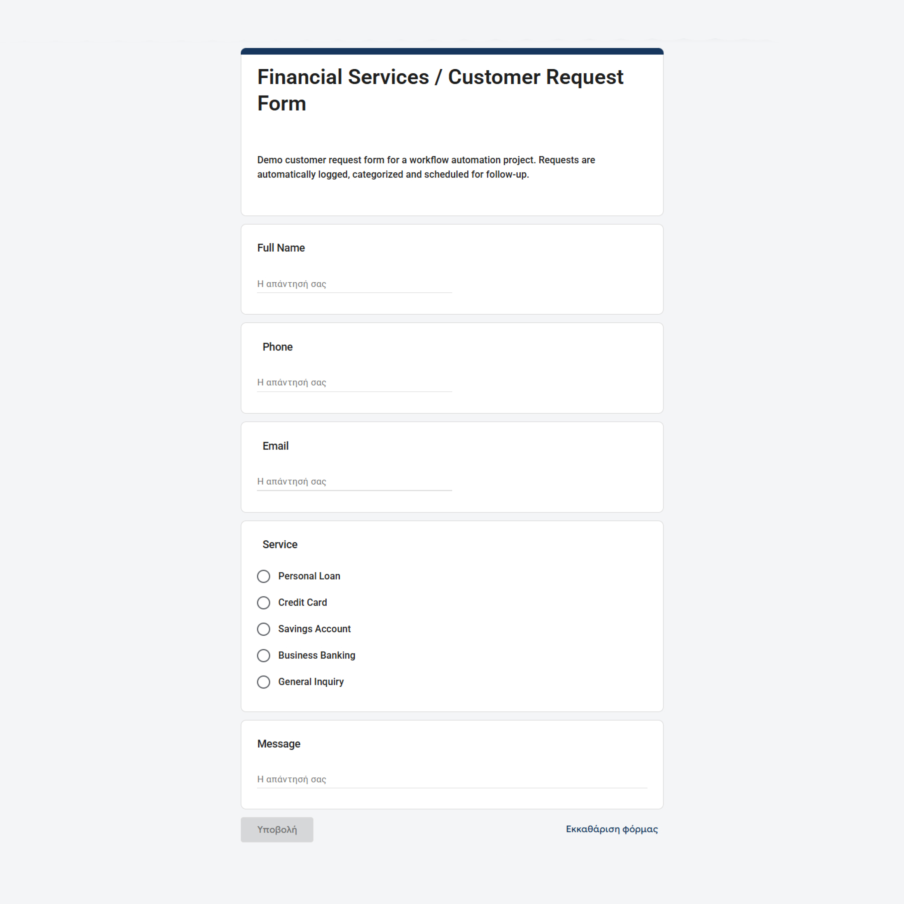
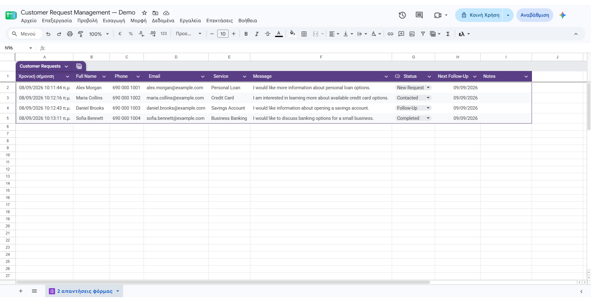
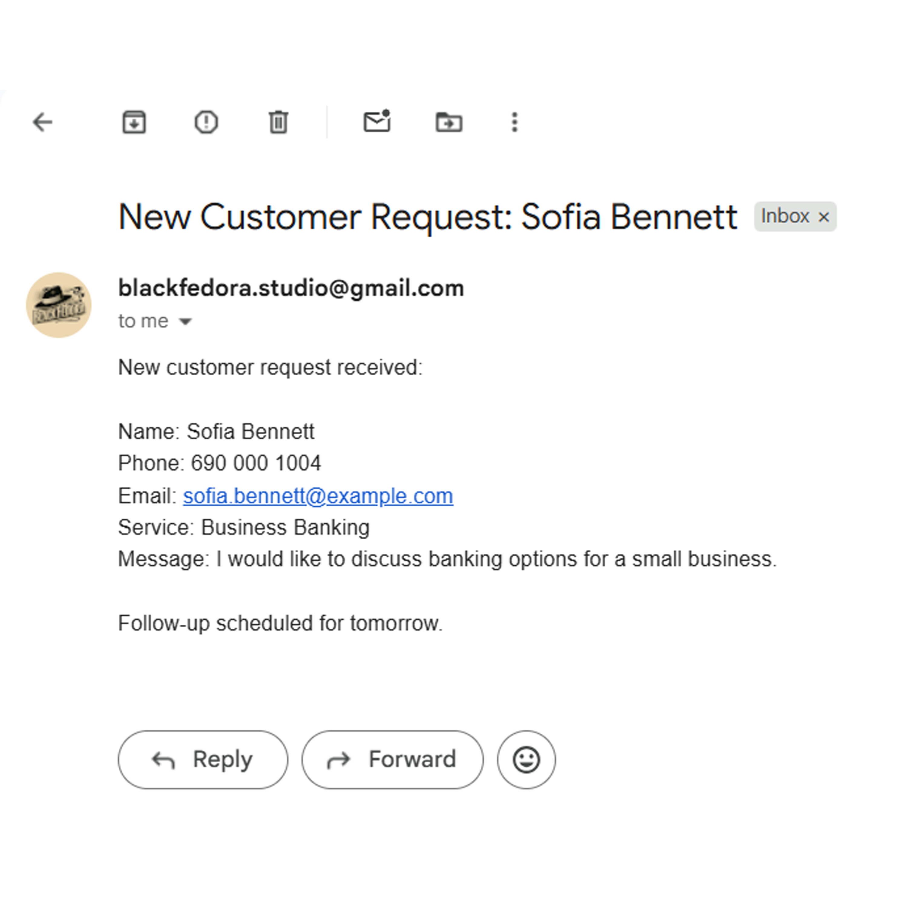
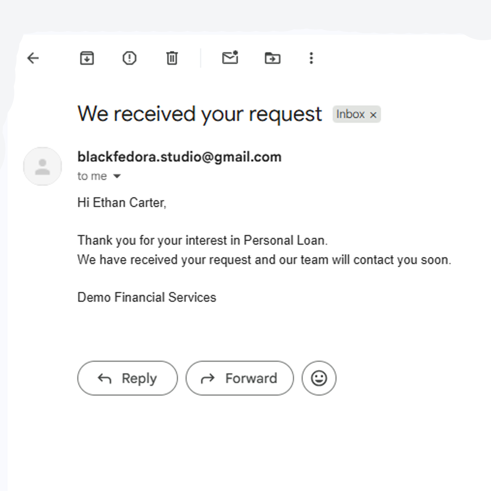
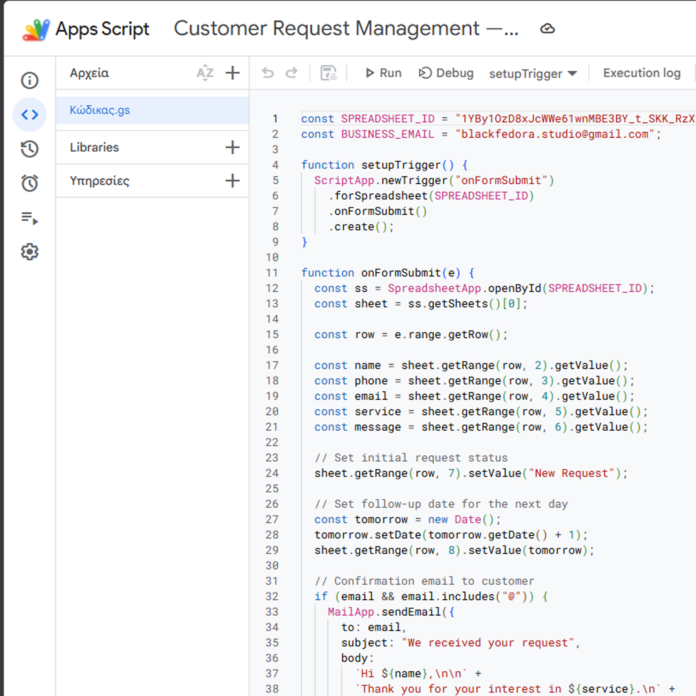

# Customer Request Management Automation

A simple customer request management system built with Google Forms, Google Sheets and Google Apps Script.

I built this project to practice workflow automation and create a basic system that could be used by a business to collect and manage customer requests.

## How it works

A customer submits a request through a Google Form. The submission is stored automatically in Google Sheets and an Apps Script trigger handles the rest of the workflow.

For every new request, the system:

- saves the customer details in the spreadsheet
- sets the status to `New Request`
- creates a follow-up date for the next day
- sends a confirmation email to the customer
- sends a notification email to the business with the request details

## Request Form

The form collects the customer's name, phone number, email, requested service and message.

## Request Tracker

All requests are kept in Google Sheets so they can be managed from one place.

The sheet includes the customer information, request status, next follow-up date and a notes field.

Statuses can be changed to `New Request`, `Contacted`, `Follow-Up` or `Completed`.

## Email Automation

The business receives an internal notification with the customer's details and request.

The customer also receives an automatic confirmation email after submitting the form.

## Automation

The automation is handled with Google Apps Script using an `onFormSubmit` trigger.

## Tools Used

- Google Forms
- Google Sheets
- Google Apps Script
- Gmail
- JavaScript

## What I practiced

This project helped me get hands-on experience with Google Apps Script, triggers, email automation and connecting different Google Workspace tools into one workflow.

It is a demo project, but the same setup could be adapted for customer support, lead collection, appointment requests or other small business workflows.
